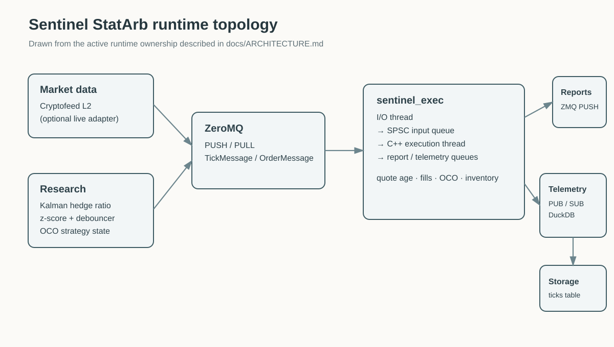
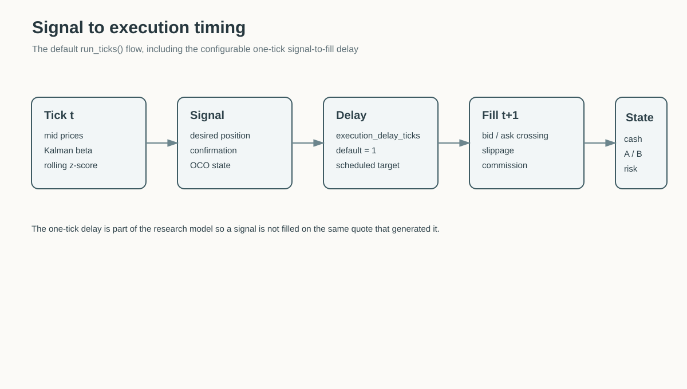
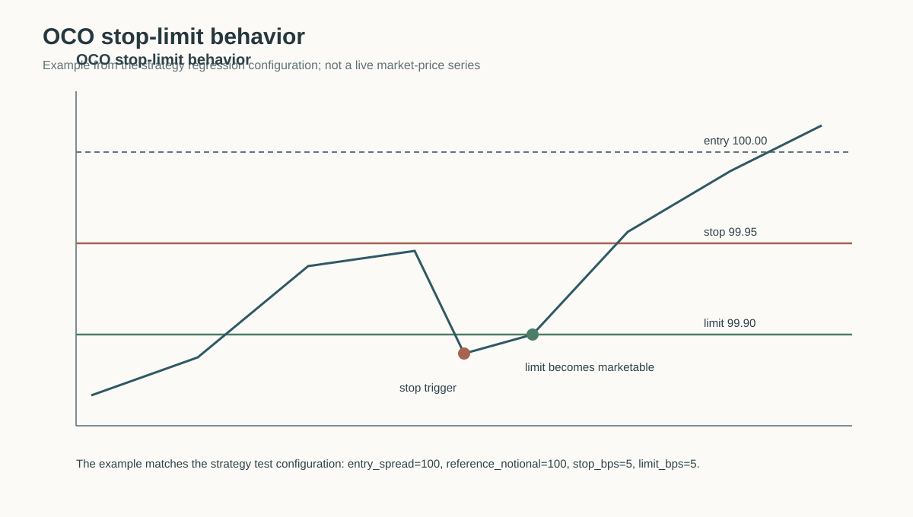
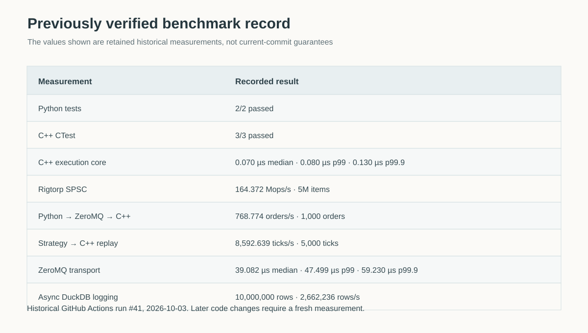
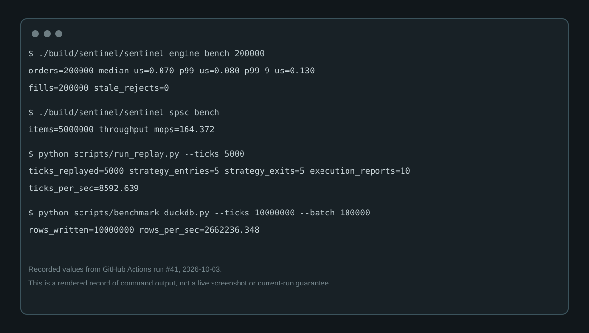
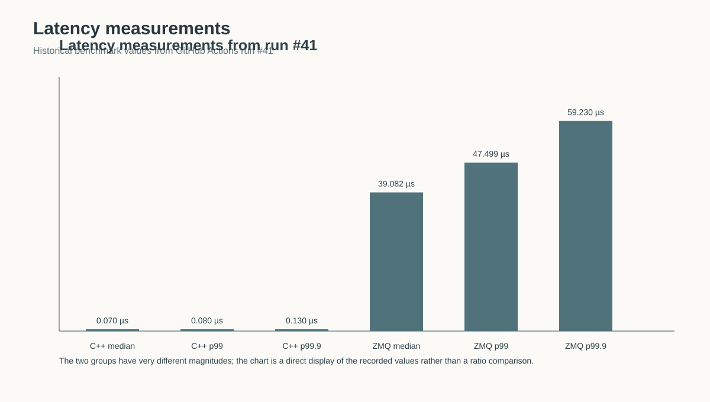
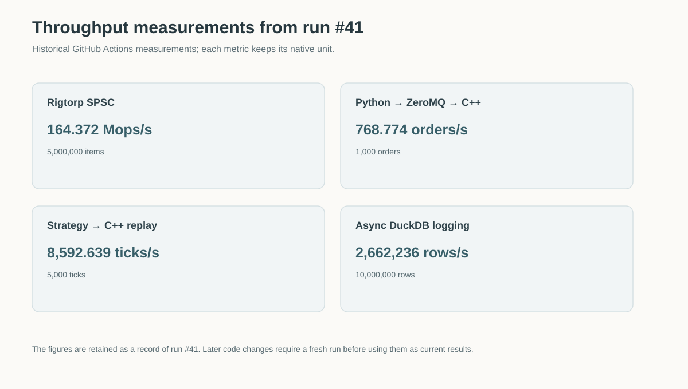
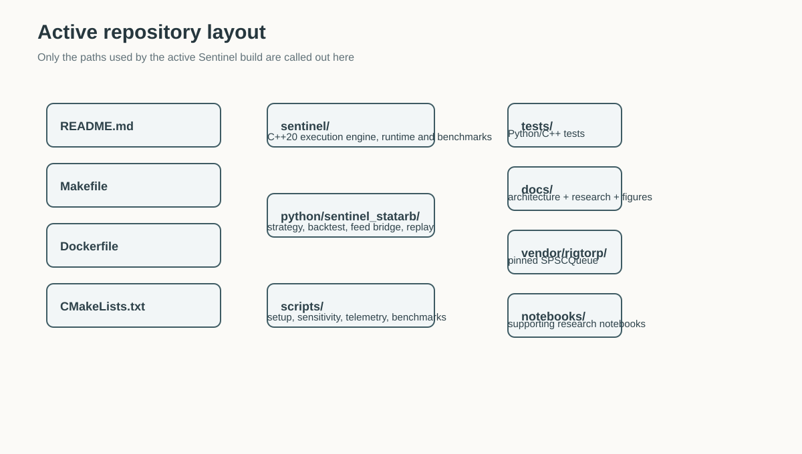

# Sentinel StatArb


Sentinel StatArb is a small research and execution stack for a two-leg statistical-arbitrage strategy. The research side is written in Python. The latency-sensitive execution side is written in C++20. ZeroMQ is used at the process boundary, a single-producer/single-consumer queue is used inside the execution process, and DuckDB is used for asynchronous telemetry storage.

The repository is intended to run from a clean checkout. The quickest supported setup is Ubuntu 24.04 or another current Debian/Ubuntu system with a C++20 compiler. A Docker image is also provided for a self-contained run.

## What is in the repository

The active Sentinel code is organized as follows:

| Path | Purpose |
| --- | --- |
| `python/sentinel_statarb/` | Strategy, synthetic data generation, portfolio backtest, DuckDB replay, Cryptofeed bridge |
| `sentinel/` | C++ execution engine, ZeroMQ process, SPSC queue integration, benchmarks |
| `scripts/` | Setup, backtest, replay, benchmark and system-profile entry points |
| `tests/` | Python tests and C++ smoke coverage |
| `docs/` | Architecture, research methodology and reproducible figures |
| `vendor/rigtorp/` | Pinned Rigtorp SPSCQueue header and license |
| `sentCryptofeed/`, `sentSrc/`, `sentTests/` | Retained historical/provenance trees from the earlier source merge; not part of the active build |

The repository also contains material from the upstream financial-models project used during the original source composition. Those notebooks and files are not required for the active Sentinel build.

## 1. Run it on Ubuntu

From a fresh clone:

```bash
git clone https://github.com/SpryzenHell/sentinel_statarb.git
cd sentinel_statarb

bash scripts/setup_ubuntu.sh
source .venv/bin/activate
```

The setup script installs the compiler/build tools, ZeroMQ development headers, Python virtual-environment support, the Python dependencies, and the C++ targets.

Verify the installation:

```bash
python scripts/verify_installation.py
```

Run the complete test suite:

```bash
make test
```

Run the complete local demonstration in one command:

```bash
make demo
```

This runs the C++ engine smoke test, the synthetic backtest, creates a small DuckDB dataset and replays it through the research engine.

Run the main synthetic backtest:

```bash
make backtest
```

Run the small end-to-end DuckDB replay demonstration:

```bash
make replay
```

At this point no exchange connection, API key, historical dataset, or user-specific configuration is required. The default demonstration uses deterministic synthetic data.

## 2. What the main commands do

### Python backtest

The default command is:

```bash
python scripts/run_backtest.py
```

It writes:

```text
results/backtest.json
```

The backtest has explicit two-leg accounting. It marks A and B separately, crosses the bid/ask when filling, applies configurable slippage and commission, tracks turnover and exposure, and calculates equity-based drawdown.

The signal-to-fill delay defaults to one tick. It can be changed together with the main strategy parameters:

```bash
python scripts/run_backtest.py \
  --entry-z 2.0 \
  --exit-z 0.5 \
  --window 200 \
  --execution-delay-ticks 1 \
  --target-notional 10000 \
  --commission-bps 0.40 \
  --slippage-bps 1.00
```

### Cost and crash sensitivity

```bash
python scripts/sensitivity_backtest.py \
  --ticks 50000 \
  --crash-at 10000,25000,40000 \
  --cost-pairs '0:0,0.4:1,1:2,2:5,5:5'
```

The result is written to `results/backtest_sensitivity.json`.

### Multi-seed robustness

```bash
python scripts/robustness_backtest.py
```

This varies deterministic seeds and crash locations. It is intended to show how sensitive the result is to the generated scenario rather than to provide a single headline number.

### Strategy parameter sensitivity

```bash
python scripts/parameter_sensitivity.py
```

This varies entry threshold, exit threshold and rolling window. The ranking is scenario-dependent and is not a claim that the top parameter set is optimal in live trading.

## 3. Build and run the C++ execution engine

The active C++ targets are built with CMake:

```bash
cmake -S . -B build -DCMAKE_BUILD_TYPE=Release
cmake --build build --parallel
ctest --test-dir build --output-on-failure
```

The basic engine smoke test can also be run directly:

```bash
./build/sentinel/sentinel_engine_smoke
```

The executable accepts `--help` and supports the runtime and paper-execution parameters used by the research model:

```bash
./build/sentinel/sentinel_exec --help
```

A typical local process invocation is:

```bash
./build/sentinel/sentinel_exec \
  ipc:///tmp/sentinel_exec_in.ipc \
  --slippage-bps 1 \
  --commission-bps 0.4 \
  --oco-stop-bps 5 \
  --oco-limit-bps 5 \
  --max-quote-age-us 250
```

For Linux hosts, optional CPU pinning, memory locking and FIFO scheduling controls are available:

```bash
./build/sentinel/sentinel_exec \
  ipc:///tmp/sentinel_exec_in.ipc \
  --cpu 4 --mlock --fifo 20
```

These options depend on the permissions and scheduler configuration of the host.

## 4. Run the end-to-end IPC tests

The repository includes a Python-to-C++ driver:

```bash
python scripts/benchmark_ipc.py --orders 10000
```

A strategy replay drives the C++ engine through the same ZeroMQ boundary:

```bash
python scripts/run_replay.py --ticks 5000
```

These commands build the executable first, then create the local IPC endpoints needed for the test.

## 5. Telemetry and DuckDB replay

The C++ execution process copies tick/report telemetry into a bounded SPSC queue. A Python subscriber moves that data through a bounded work queue and writes it to DuckDB.

For a small reproducible replay:

```bash
python scripts/generate_sample_telemetry_db.py --ticks 5000
python scripts/replay_duckdb.py \
  --db results/sample_telemetry.duckdb
```

For the connected telemetry path:

```bash
python scripts/benchmark_telemetry.py \
  --ticks 100000 \
  --batch 10000
```

The larger storage benchmark can be run separately:

```bash
python scripts/benchmark_duckdb.py \
  --ticks 10000000 \
  --batch 100000
```

The 10M-row command is intentionally not part of the normal quick verification because it is a longer storage benchmark.

## 6. Optional Cryptofeed live bridge

The live adapter is optional. Install it only when live market-data access is required:

```bash
source .venv/bin/activate
pip install -e '.[full,live]'
```

The default bridge configuration is Coinbase with BTC-USD and ETH-USD:

```bash
python -m sentinel_statarb.feed \
  --endpoint ipc:///tmp/sentinel_exec_in.ipc \
  --exchange COINBASE \
  --symbol-a BTC-USD \
  --symbol-b ETH-USD
```

Start `sentinel_exec` before starting the feed bridge.

The bridge normalizes the best bid/ask from both books into the packed `TickMessage` format used by the C++ process. Network access is required for this mode. The live bridge is deliberately separate from the deterministic tests, so the default repository verification does not depend on an exchange being available.

## 7. Docker

A Dockerfile is provided for a clean, isolated run.

Build:

```bash
docker build -t sentinel-statarb .
```

Run the default backtest:

```bash
docker run --rm sentinel-statarb
```

The image installs the Python package, builds the C++ targets and starts with the same deterministic backtest used by the normal quick-start path.

For users on Windows or macOS who do not want to set up the native Linux toolchain, Docker is the simplest way to reproduce the project environment.

## 8. Benchmarks

The project has separate benchmarks for the execution core, SPSC queue, ZeroMQ transport, end-to-end IPC, strategy replay and DuckDB storage.

A historical GitHub Actions run (#41, 2026-10-03) recorded the following results:

| Measurement | Recorded result |
| --- | ---: |
| Python tests | 2/2 passed |
| C++ CTest | 3/3 passed |
| C++ execution core | 0.070 µs median · 0.080 µs p99 · 0.130 µs p99.9 |
| Rigtorp SPSC | 164.372 Mops/s for 5M items |
| Python → ZeroMQ → C++ | 768.774 orders/s for 1,000 orders |
| Strategy → C++ replay | 8,592.639 ticks/s for 5,000 ticks |
| ZeroMQ transport | 39.082 µs median · 47.499 µs p99 · 59.230 µs p99.9 |
| Async DuckDB logging | 10,000,000 rows at 2,662,236 rows/s |

These are historical measurements from that runner. The active branch has changed since that run, so the values above are evidence of the recorded run, not a claim about the current commit.

For a new measurement:

```bash
python scripts/system_profile.py | tee results/system_profile.json
./build/sentinel/sentinel_engine_bench 200000
./build/sentinel/sentinel_spsc_bench
./build/sentinel/sentinel_zmq_bench 10000
./build/sentinel/sentinel_zmq_oneway 200000 -1 -1
```

On a Linux host where CPU pinning is appropriate:

```bash
./build/sentinel/sentinel_engine_bench 200000 --cpu 4
```

The repository does not treat the terms “HPC”, “sub-10 µs”, or “sub-millisecond” as measured facts unless the corresponding benchmark has actually been run and preserved.

For a clean-checkout verification, `python scripts/verify_installation.py` checks the Python dependencies, required native binaries and the `sentinel_exec --help` path.

## 9. Figures and implementation diagrams

The figures in this README are generated from the repository's implementation and recorded benchmark data. The project is a command-line/service stack rather than a GUI, so there are no fabricated product screenshots or placeholder performance charts.

### Runtime topology



### Signal and execution timing



### OCO stop-limit behavior



The OCO example uses the same 100.00 entry and 5 bps stop/limit test configuration used in the strategy regression tests. It is an explanation of the state machine, not a market-price recording.

### Historical benchmark record



### Recorded command-line run



### Latency measurements



### Throughput measurements



### Active project layout



## 10. Research model

The current strategy has four main pieces:

1. A scalar Kalman regression estimates the hedge ratio between the two instruments.
2. The spread is formed from the two midpoint prices and standardized with a rolling sample standard deviation.
3. A volatility-aware debouncer increases the confirmation count as observed volatility rises.
4. An OCO stop-limit bracket is armed for an active spread position.

The portfolio layer is separate from the signal layer. It handles actual A/B quantities, execution costs, cash and exposure. The same `run_ticks()` function is used for generated scenarios and streamed DuckDB replays.

The research methodology is documented in [docs/RESEARCH_METHODOLOGY.md](docs/RESEARCH_METHODOLOGY.md). The runtime ownership and queue design are documented in [docs/ARCHITECTURE.md](docs/ARCHITECTURE.md).

## 11. Tests and checks

Python tests:

```bash
python -m pytest -q
```

C++ tests:

```bash
ctest --test-dir build --output-on-failure
```

Installation check:

```bash
python scripts/verify_installation.py
```

C++ sanitizer smoke tests are also defined in GitHub Actions. The standard CI workflow covers Python syntax/tests, C++ compilation, CTest, research scripts, IPC, telemetry, replay and benchmark commands.

## 12. Supported environment

The native setup is maintained and tested around:

- Ubuntu 24.04
- Python 3.12
- C++20
- CMake 3.20 or newer
- libzmq 4.x development headers
- Git

Ubuntu/Debian systems are the primary native target. Docker is provided for users who prefer a containerized environment.

Windows and macOS native execution are not treated as release targets in this repository. Docker or a Linux environment such as WSL2 is recommended there.

## 13. What is not included

The default repository run does not require anything outside the repository, but several optional capabilities naturally need external inputs:

- live market data requires network connectivity;
- private exchange feeds would require the credentials and configuration for that venue;
- replaying a real historical dataset requires that dataset to be supplied;
- venue-specific fees, borrow, funding, queue position and market impact are not modeled by the current paper executor.

Those are extension points rather than prerequisites for the deterministic demo and test suite.

## 14. Source provenance and licenses

The original project composition used:

- Cryptofeed
- Financial-Models-Numerical-Methods
- Rigtorp SPSCQueue

Pinned source references and the reason for keeping the historical merged trees are recorded in [PROVENANCE.md](PROVENANCE.md).

Third-party licensing information is in [THIRD_PARTY_NOTICES.md](THIRD_PARTY_NOTICES.md). Project licensing is in [LICENSE](LICENSE).

## 15. Development and contribution

The normal local cycle is:

```bash
source .venv/bin/activate
make test
make backtest
make replay
```

For a larger change, run the relevant benchmark after the code change and keep the output with the CI artifacts or benchmark record. Do not copy performance numbers from another machine and present them as local measurements.

The project window recorded in `INPUT_projects.json` is 2026-02-01 through 2026-05-31. New commits are made with their actual commit timestamps.
